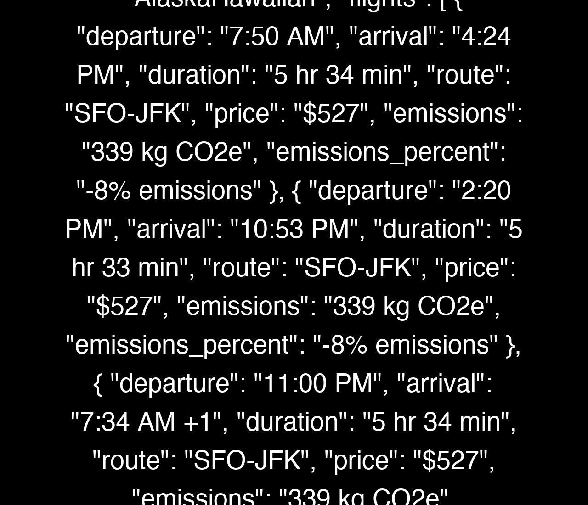
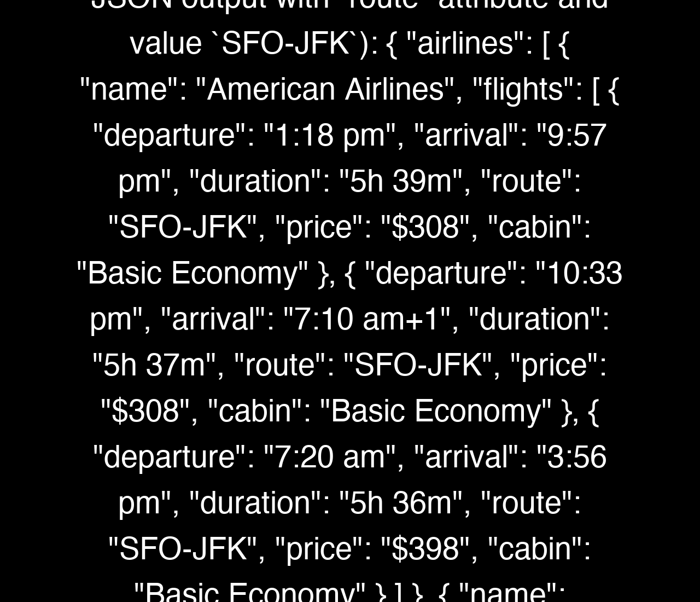

# Kayak and Google Flights Search Agent

- [browser-use GitHub repository](https://github.com/browser-use/browser-use)

This project provides asynchronous agents to search for flights on Kayak and Google Flights. The agents use the `browser-use` library to interact with the websites and extract flight details.



## Features

- Search for flights on Kayak and Google Flights.
- Extract flight details such as departure, arrival, duration, route, price, and more.
- Group flight results by airline.
- Output results in a structured JSON format.



## Setup

1. **Clone the repository:**
    ```sh
    git clone https://github.com/josoroma/browser-use-flight-search.git
    cd browser-use-flight-search
    ```

2. **Install dependencies:**
    ```sh
    make setup
    ```

3. **Set up environment variables:**
    Create a `.env` file in the root directory and add the following variables:
    ```properties
    ANONYMIZED_TELEMETRY=false

    OPENAI_API_KEY=your_openai_api_key
    OPENAPI_MODEL_NAME=gpt-4o
    
    OLLAMA_MODEL_NAME=qwen2.5:32b
    OLLAMA_BASE_URL=http://localhost:11434
    OLLAMA_TEMPERATURE=0.1
    ```

## Project Structure

- `src/`: Contains the source code for the project.
  - `lib/`: Utility functions and modules for building URLs and running agents.
  - `tasks/`: Task description generators for Kayak and Google Flights.
  - `typings.py`: Pydantic models for representing flight details and airline information.
  - `constants.py`: Environment variables and JSON schemas for flight search results.
  - `main_kayak_flights.py`: Main module for running the Kayak Flights search agent.
  - `main_google_flights.py`: Main module for running the Google Flights search agent.
- `.env`: Environment variables file.
- `pyproject.toml`: Project configuration file for Poetry.
- `makefile`: Makefile for common tasks.

## Usage

### Running the Agents

To run the flight search agents, use the following command:

```sh
poetry run python main.py <departure> <destination> <date> [<return_date>]
```

- `<departure>`: Departure airport code (e.g., SFO).
- `<destination>`: Destination airport code (e.g., JFK).
- `<date>`: Departure date in YYYY-MM-DD format.
- `[<return_date>]`: Optional return date in YYYY-MM-DD format.

#### Example:

```sh
poetry run python main.py SFO JFK 2025-10-10 2025-11-10
```

### JSON Structured Outputs:

```
{
    "airlines": [
        {
            "name": "American Airlines",
            "flights": [
                {
                    "departure": "1:18 PM",
                    "arrival": "9:57 PM",
                    "duration": "5 hr 39 min",
                    "route": "SFO-JFK",
                    "price": "$308",
                    "emissions": "583 kg CO2e",
                    "emissions_percent": "+59% emissions"
                },
                {
                    "departure": "10:33 PM",
                    "arrival": "7:10 AM +1",
                    "duration": "5 hr 37 min",
                    "route": "SFO-JFK",
                    "price": "$308",
                    "emissions": "583 kg CO2e",
                    "emissions_percent": "+59% emissions"
                },
                {
                    "departure": "7:20 AM",
                    "arrival": "3:56 PM",
                    "duration": "5 hr 36 min",
                    "route": "SFO-JFK",
                    "price": "$398",
                    "emissions": "583 kg CO2e",
                    "emissions_percent": "+59% emissions"
                },
                {
                    "departure": "10:52 AM",
                    "arrival": "7:29 PM",
                    "duration": "5 hr 37 min",
                    "route": "SFO-JFK",
                    "price": "$398",
                    "emissions": "583 kg CO2e",
                    "emissions_percent": "+59% emissions"
                }
            ]
        },
        {
            "name": "JetBlue",
            "flights": [
                {
                    "departure": "7:40 AM",
                    "arrival": "4:12 PM",
                    "duration": "5 hr 32 min",
                    "route": "SFO-JFK",
                    "price": "$407",
                    "emissions": "422 kg CO2e",
                    "emissions_percent": "+15% emissions"
                },
                {
                    "departure": "1:22 PM",
                    "arrival": "10:05 PM",
                    "duration": "5 hr 43 min",
                    "route": "SFO-JFK",
                    "price": "$407",
                    "emissions": "422 kg CO2e",
                    "emissions_percent": "+15% emissions"
                },
                {
                    "departure": "8:30 PM",
                    "arrival": "5:00 AM +1",
                    "duration": "5 hr 30 min",
                    "route": "SFO-JFK",
                    "price": "$407",
                    "emissions": "422 kg CO2e",
                    "emissions_percent": "+15% emissions"
                }
            ]
        },
        {
            "name": "Alaska Hawaiian",
            "flights": [
                {
                    "departure": "7:50 AM",
                    "arrival": "4:24 PM",
                    "duration": "5 hr 34 min",
                    "route": "SFO-JFK",
                    "price": "$527",
                    "emissions": "339 kg CO2e",
                    "emissions_percent": "-8% emissions"
                },
                {
                    "departure": "2:20 PM",
                    "arrival": "10:53 PM",
                    "duration": "5 hr 33 min",
                    "route": "SFO-JFK",
                    "price": "$527",
                    "emissions": "339 kg CO2e",
                    "emissions_percent": "-8% emissions"
                }
            ]
        },
        {
            "name": "Delta",
            "flights": [
                {
                    "departure": "9:00 PM",
                    "arrival": "5:42 AM +1",
                    "duration": "5 hr 42 min",
                    "route": "SFO-JFK",
                    "price": "$447",
                    "emissions": "445 kg CO2e",
                    "emissions_percent": "+21% emissions"
                },
                {
                    "departure": "4:00 PM",
                    "arrival": "1:11 AM +1",
                    "duration": "6 hr 11 min",
                    "route": "SFO-JFK",
                    "price": "$527",
                    "emissions": "445 kg CO2e",
                    "emissions_percent": "+21% emissions"
                },
                {
                    "departure": "10:45 PM",
                    "arrival": "7:35 AM +1",
                    "duration": "5 hr 50 min",
                    "route": "SFO-JFK",
                    "price": "$527",
                    "emissions": "306 kg CO2e",
                    "emissions_percent": "-17% emissions"
                }
            ]
        }
    ]
}
```

```
{
    "airlines": [
        {
            "name": "American Airlines",
            "flights": [
                {
                    "departure": "1:18 pm",
                    "arrival": "9:57 pm",
                    "duration": "5h 39m",
                    "route": "SFO-JFK",
                    "price": "$308",
                    "cabin": "Basic Economy"
                },
                {
                    "departure": "10:33 pm",
                    "arrival": "7:10 am +1",
                    "duration": "5h 37m",
                    "route": "SFO-JFK",
                    "price": "$308",
                    "cabin": "Basic Economy"
                }
            ]
        },
        {
            "name": "Delta",
            "flights": [
                {
                    "departure": "9:00 pm",
                    "arrival": "5:42 am +1",
                    "duration": "5h 42m",
                    "route": "SFO-JFK",
                    "price": "$447",
                    "cabin": "Basic Economy"
                }
            ]
        }
    ]
}
```

## License

This project is licensed under the MIT License.
